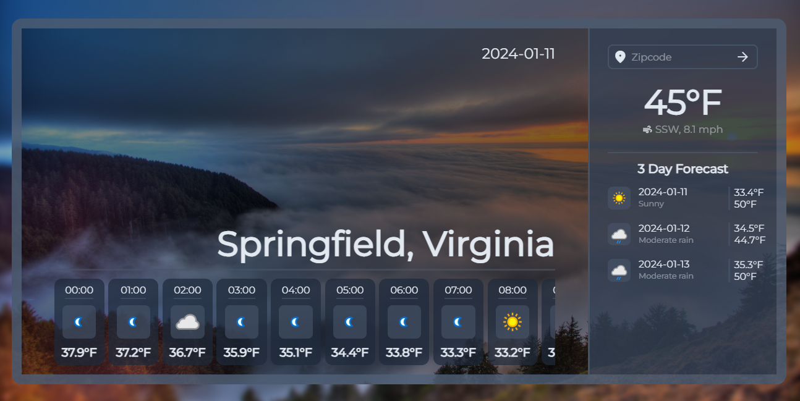

# Weather-App
Weather App containing a searchable zipcode for a location's weather displaying a 24 hour weather forecast and 3 day forecast from a free weather API. 

## Access
Accessible from https://ama4538.github.io/Weather-App/

## Installation
1. Clone the repository: git clone https://github.com/Ama4538/Weather-App.git
2. install dependencies: npm install
3. Run built in script: npm run start

### Tech Stack
- HTML
- CSS
- JavaScript

### Tools
- Webpack

## Credit
- Background image by NOAA from unsplash - https://unsplash.com/photos/foggy-mountain-during-golden-hour-cthDc0hUM0o